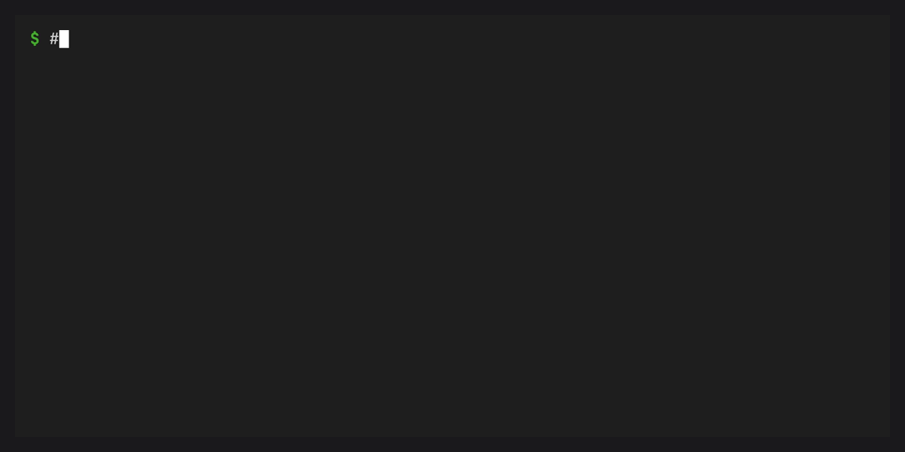
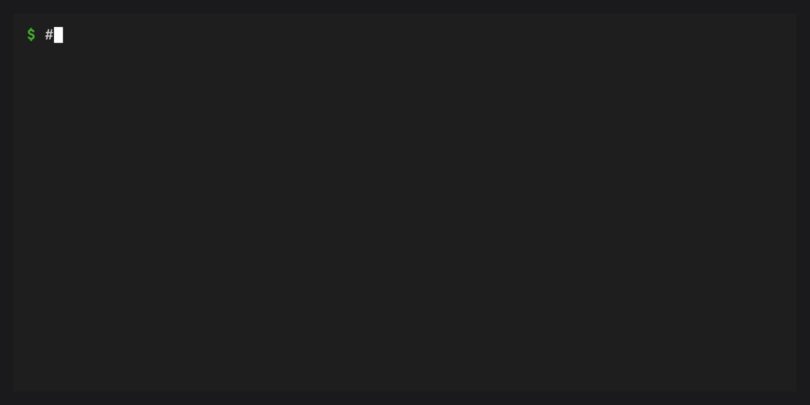

# Features

## Single-binary bootstrapper



cx is a single static binary (7-11 MB depending on platform) written in Rust. It requires no Python,
no installer framework, and no shell modifications. Download it, run it, and
you have a working conda installation.

## Build-time lockfile

The conda-express release workflow solves the package set at build time.
Pronto derives a
[rattler-lock v6](https://github.com/conda/rattler/tree/main/crates/rattler_lock)
runtime lock that is stamped into the staged binary. At runtime, bootstrap
skips repodata fetching and solving entirely; it downloads and installs
packages directly from the locked URLs.

This gives cx deterministic, reproducible bootstraps with ~3–5 second install
times.

## Package exclusion

conda on conda-forge hard-depends on `conda-libmamba-solver`, which pulls in
27 native dependencies (libsolv, libarchive, libcurl, spdlog, etc.). Since cx
uses `conda-rattler-solver` instead, these are unnecessary.

cx removes them via a post-solve transitive dependency pruning algorithm:
after the solver produces a complete solution, cx identifies packages that are
*exclusively* required by the excluded packages and removes them. This reduces
the install from ~125 to ~95 packages (varies by platform).

## conda-rattler-solver

cx configures [conda-rattler-solver](https://github.com/jaimergp/conda-rattler-solver)
as the default solver via `.condarc`. This solver is based on
[resolvo](https://github.com/mamba-org/resolvo), the fastest SAT solver in the
conda ecosystem, and ships as a pure Python package with
[py-rattler](https://pypi.org/project/py-rattler/) wheels.

## conda-spawn activation


cx ships with [conda-spawn](https://github.com/conda-incubator/conda-spawn)
and disables traditional `conda activate`/`deactivate`/`init`. Instead:

```bash
cx shell myenv          # spawns a subshell with myenv activated
exit                    # leaves the environment
```

No `.bashrc`/`.zshrc` modifications required. Just add `~/.cx/condabin` to
your `PATH`.

## `cx shell` alias

`cx shell` is a convenience alias for `conda spawn`. It works identically:

```bash
cx shell myenv          # same as: conda spawn myenv
```

## conda-completion

cx includes `conda-completion` so the bootstrapped conda installation can offer
shell completion support for conda commands and plugin subcommands.

## conda-workspaces



cx includes [conda-workspaces](https://conda-incubator.github.io/conda-workspaces/),
which adds project-scoped multi-environment workspace management and a built-in
task runner to conda. After bootstrap, two new subcommands are available:

```bash
# One-step bootstrap: init, add, install, and open a shell
cx workspace quickstart --name my-project python numpy

# Or step by step
cx workspace init --name my-project
cx workspace add python numpy
cx workspace install

# Define and run tasks
cx task run test
cx task list
```

conda-workspaces reads workspace manifests from `conda.toml`, `pixi.toml`, or
`pyproject.toml` — making it compatible with existing pixi projects. See the
[conda-workspaces documentation](https://conda-incubator.github.io/conda-workspaces/)
for the full feature set.

## conda-global

cx includes [conda-global](https://conda-incubator.github.io/conda-global/),
which adds global tool management to conda. Install CLI tools into isolated
environments and expose them on your PATH — the same workflow as `pipx` or
`pixi global`, without leaving the conda ecosystem:

```bash
# Install a tool globally
cx global install ruff

# List globally installed tools
cx global list

# Remove a globally installed tool
cx global remove ruff
```

See the [conda-global documentation](https://conda-incubator.github.io/conda-global/)
for the full feature set.

## Frozen base prefix (CEP 22)


After bootstrap, cx writes a `conda-meta/frozen` marker file per
[CEP 22](https://conda.org/learn/ceps/cep-0022/). This protects the base
prefix from accidental modification. Users should create named environments
for their work:

```bash
cx create -n myenv numpy pandas
cx shell myenv
```

## Auto-bootstrap

If the prefix doesn't exist when you run a conda command, cx automatically
bootstraps before executing:

```bash
# First time: bootstraps ~/.cx, then creates the environment
cx create -n myenv python=3.12
```

## External lockfile support

For custom deployments, you can override the stamped runtime lock:

```bash
cx bootstrap --lockfile /path/to/custom.lock
```

Or skip the lockfile entirely for a live solve:

```bash
cx bootstrap --no-lock
```

## Offline bootstrap

cx supports fully offline, air-gapped bootstrap from a local directory of
package archives or from a previously populated package cache. This enables
deployment in restricted-network environments and native installers that bundle
cx alongside a package bundle.

Two flags control this behavior:

- `--bundle DIR` points to a directory of `.conda` / `.tar.bz2` archives.
  cx pre-populates the rattler package cache from this directory, then
  installs from cache. Without `--offline`, missing packages fall back to
  network download.
- `--offline` disables all network access. All packages must be available
  locally (in the cache or bundle). Incompatible with `--no-lock`.

```bash
# Re-use packages from a previous bootstrap (no network)
cx bootstrap --prefix /opt/conda --offline

# Install from a bundled package directory (fully air-gapped)
cx bootstrap --bundle ./packages/ --offline
```

Both flags can also be set via the `CX_BUNDLE` and `CX_OFFLINE` environment
variables, making them easy to use from native installer post-install scripts.

## Self-contained binary (cxz)

`cxz` takes offline bootstrap one step further: it embeds the package archives
themselves into the binary. One 50-95 MB file (varies by platform), zero network access, drop it
anywhere.

```
cx (7-11 MB)              cxz (50-95 MB)
┌──────────────┐          ┌──────────────────┐
│  cx binary   │          │  cx binary       │
│  (7-11 MB)   │          │  (7-11 MB)       │
├──────────────┤          ├──────────────────┤
│  lockfile    │          │  lockfile        │
│  (~130 KB)   │          │  (~130 KB)       │
│              │          ├──────────────────┤
│              │          │  bundle.tar.zst  │
│              │          │  (40-85 MB)      │
└──────────────┘          └──────────────────┘
```

`cxz` is the official conda-express embedded-bundle variant built by Pronto. It
detects its embedded bundle automatically and behaves as if `--bundle
--offline` were passed. All other flags and subcommands work identically.

It is distributed via GitHub Releases (alongside `cx`) and as a pre-bootstrapped
Docker image. For non-conda-express embedded variants, use Pronto directly; see
the [custom builds guide](guides/custom-builds.md).

## Uninstall (`cx uninstall`)

cx provides a clean uninstall command that reverses the bootstrap:

```bash
cx uninstall
```

This will:

1. List what will be removed (prefix and named environments)
2. Ask for confirmation (`--yes` to skip)
3. Remove the conda prefix and all environments
4. Clean up PATH entries from shell profiles
5. Print a hint for removing the `cx` binary through the install method you used

## Release artifacts

Official `cx` and `cxz` release artifacts are built in GitHub Actions with
Pronto. The conda-express workflows are for CI, release, and release
preparation; they are not the public generic builder interface. Each release
artifact includes the binary plus `.sha256`, `.info.json`, `.runtime.lock`, and
`.packages.txt` metadata for auditing and downstream packaging.

## PyPI and crates.io distribution

cx is published as `conda-express` on both
[PyPI](https://pypi.org/project/conda-express/) and
[crates.io](https://crates.io/crates/conda-express):

```bash
pip install conda-express       # from PyPI
cargo install conda-express     # from crates.io
```

Both distributions consume the Pronto-built `cx` release artifacts instead of
building the runtime source in this repository.

## Multi-platform support

cx builds and tests on 5 platforms via GitHub Actions:

| Platform | Runner |
|---|---|
| linux-x64 | `ubuntu-latest` |
| linux-aarch64 | `ubuntu-24.04-arm` |
| macos-x64 | `macos-15-large` |
| macos-arm64 | `macos-latest` |
| windows-x64 | `windows-latest` |
